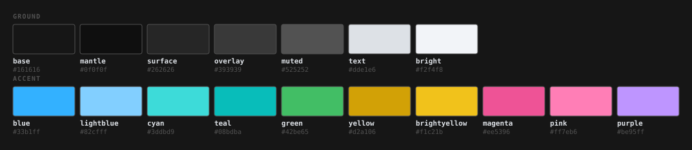
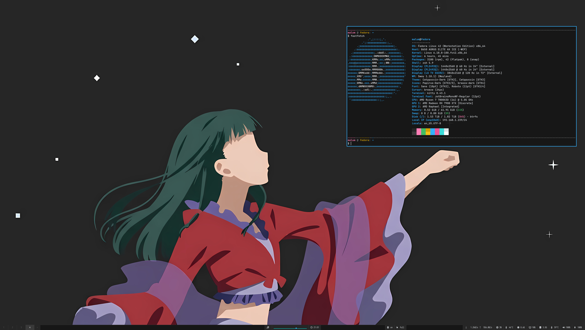
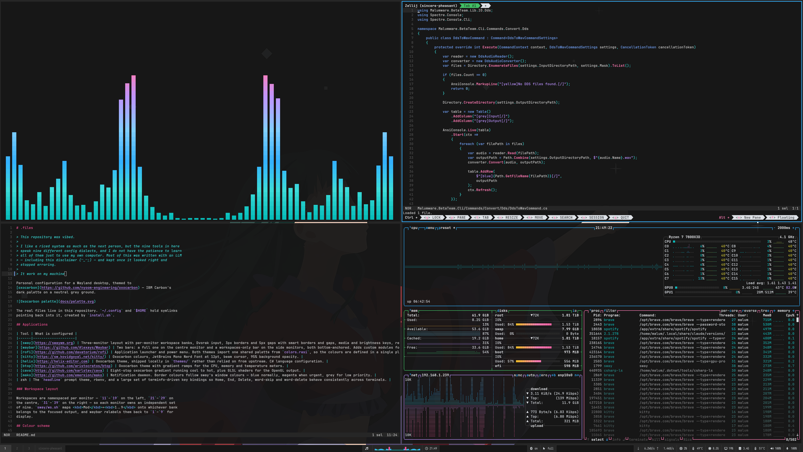

# .files

> This repository was vibed.
>
> I like a riced system as much as the next person, but the ten tools in here
> speak ten different config dialects, and I do not have the patience to learn
> all of them just to use my own computer. Most of this was written with an LLM
> — including this disclaimer (⌒_⌒;) — and kept once it looked right and
> stopped erroring.
>
> It work on my machine

Personal configuration for a Wayland desktop, themed to
[oxocarbon](https://github.com/nyoom-engineering/oxocarbon) — IBM Carbon's
dark palette on a neutral grey ground.

The real files live in this repository. `~/.config` and `$HOME` hold symlinks
pointing back into it, created by `install.sh`.

## Screenshots

The bare desktop, and a session with a few of the themed applications open:

## Applications

| Tool | What is configured |
|------|--------------------|
| [sway](https://swaywm.org) | Three-monitor layout with per-monitor workspace banks, Dvorak input, 3px borders and 5px gaps with smart borders and gaps, media and brightness keys, region screenshots via grim and slurp, and a resize mode with an on-screen hint. Palette is pulled in with `include oxocarbon.txt`. |
| [waybar](https://github.com/Alexays/Waybar) | Two bars: a full one on the centre monitor and a workspaces-only bar on the side monitors, both bottom-anchored. Adds custom modules for AMD GPU load, VRAM and temperature, a cava audio visualiser, and battery levels for connected wireless peripherals. |
| [rofi](https://github.com/davatorium/rofi) | Application launcher and power menu. Both themes import one shared palette from `colors.rasi`, so the colours are defined in a single place. |
| [kitty](https://sw.kovidgoyal.net/kitty/) | Oxocarbon colours, JetBrains Mono Nerd Font at 12pt, beam cursor, 95% background opacity. |
| [helix](https://helix-editor.com) | Oxocarbon theme, shipped locally in `themes/` rather than relied on from upstream. C# language configuration. |
| [btop](https://github.com/aristocratos/btop) | Oxocarbon theme with gradient ramps for the CPU, memory and temperature meters. |
| [cava](https://github.com/karlstav/cava) | Eight-stop oxocarbon gradient running cool to hot, plus GLSL shaders for the OpenGL output. |
| [mako](https://github.com/emersion/mako) | Notification daemon. Border colours follow sway's window colours — blue normally, magenta when urgent, grey for low priority. |
| GTK | No theme is installed. Stock Adwaita is repainted in place from `~/.config/gtk-3.0` and `~/.config/gtk-4.0`, which is the only route that reaches libadwaita applications — those ignore `~/.themes` entirely. Icons are Papirus-Dark. See [GTK](#gtk). |
| zsh | oh-my-zsh with the `bira` prompt and the docker, dotnet, git, kubectl and opentofu plugins. rbenv is initialised from `.zprofile`. See [The shell](#the-shell). |

### Workspace layout

Workspaces are namespaced per monitor — `11`–`19` on the left, `21`–`29` on
the centre, `31`–`39` on the right — so each monitor owns an independent set
of nine. `sway/ws.sh` maps <kbd>Mod</kbd>+<kbd>1..9</kbd> onto whichever bank
belongs to the focused output, and waybar relabels them back to `1`–`9` for
display.

## Colour scheme

Oxocarbon, defined once per tool in a dedicated palette file:

| Tool | Palette lives in |
|------|------------------|
| sway | `config/sway/oxocarbon.txt` |
| kitty | `config/kitty/oxocarbon.conf` |
| rofi | `config/rofi/colors.rasi` |
| btop | `config/btop/themes/oxocarbon.theme` |
| helix | `config/helix/themes/oxocarbon.toml` |
| cava | `config/cava/config` |
| mako | `config/mako/config` |
| GTK 3 | `config/gtk-3.0/oxocarbon.css` |
| GTK 4 | `config/gtk-4.0/oxocarbon.css` |

| Role | Hex | | Accent | Hex |
|------|-----|-|--------|-----|
| base | `#161616` | | blue | `#33b1ff` |
| mantle | `#0f0f0f` | | lightblue | `#82cfff` |
| surface | `#262626` | | cyan | `#3ddbd9` |
| overlay | `#393939` | | teal | `#08bdba` |
| muted | `#525252` | | green | `#42be65` |
| text | `#dde1e6` | | yellow | `#d2a106` |
| bright | `#f2f4f8` | | brightyellow | `#f1c21b` |
| | | | magenta | `#ee5396` |
| | | | pink | `#ff7eb6` |
| | | | purple | `#be95ff` |

One deliberate departure from upstream: oxocarbon has no yellow and parks
Carbon's light blue in terminal slot 3. Here slot 3 carries Carbon yellow-40
and yellow-30 instead, so warnings, `ls` output and diffs read as yellow. The
light blue stays reachable as `lightblue`.

GitHub renders colour swatches for backticked hex codes in issues, pull
requests and discussions, but not in README files — hence the SVG above.

### GTK

The two GTK palette files above are the same colours written twice, and the
files that use them look nothing alike: `config/gtk-4.0/gtk.css` is one import
line, `config/gtk-3.0/gtk.css` is two hundred lines of explicit rules. That is
not an oversight at either end.

No theme is installed. Stock Adwaita is repainted in place, because a theme in
`~/.themes` cannot colour a libadwaita application — those read
`~/.config/gtk-4.0/gtk.css` and nothing else. Redefining libadwaita's colour
names is enough on its own, since it resolves them while it runs.

GTK 3 does not work that way. Its Adwaita stylesheet defines the usual thirty-
six colour names, never refers to them again, and paints from some eight
hundred literal hex values. The names are there for other programs to read
out of the theme, not for the theme to draw with, so redefining them changes
nothing you can see. Every surface has to be named and repainted by hand, and
any surface the file misses keeps Adwaita's own grey.

Two traps came out of getting this wrong, both silent:

- The GTK 3 theme is `Adwaita` with `gtk-application-prefer-dark-theme`, never
  `Adwaita-dark`. `/usr/share/themes/Adwaita-dark` holds a `gtk-2.0` directory
  and nothing else, so GTK 3 cannot resolve it, falls back to its built-in
  default and lands on the *light* variant. Naming it produces a white
  desktop with no error anywhere.
- Asking GTK what a colour name resolves to proves nothing on GTK 3, since the
  definition comes from these files whichever theme won. Ask what it paints,
  or take a screenshot and count the colours.

## Fonts

| Font | Used by |
|------|---------|
| JetBrains Mono Nerd Font | kitty, rofi |
| Iosevka Nerd Font | waybar, mako |
| Roboto | sway window titles, GTK applications |

Two monospace families rather than one is not a decision so much as an
accident. See [TODO](#todo).

## Layout

| Path | Links to | Contents |
|------|----------|----------|
| `config/` | `~/.config/<name>` | `btop` `cava` `gtk-3.0` `gtk-4.0` `helix` `kitty` `mako` `nnn` `rofi` `sway` `waybar` `zellij` |
| `home/` | `~/<name>` | `.zshrc` `.zprofile` |

zsh reads from `$HOME` rather than `~/.config`, which is why it sits in
`home/` instead of alongside the rest.

Directories are linked whole rather than file by file. That keeps the number
of links small, means a new file inside a configuration directory is tracked
without touching `install.sh`, and avoids the usual symlink hazard: an
application that saves settings by writing a temporary file and renaming it
over the original would replace a file-level symlink with a real file and
silently stop updating the repository. btop rewrites its own config file on
exit, so it is exactly the kind of application this guards against. With the
directory linked instead, the file it rewrites is the real one in here.

## Installing

    git clone git@github.com:MalumAtire832/DotFiles.git ~/.files
    ~/.files/install.sh

`install.sh` is idempotent. A target that is already the right symlink is left
alone; anything real found in the way is moved to `<path>.backup-<timestamp>`
rather than overwritten. Re-run it after adding a directory.

### Requirements

Beyond the ten applications above:

| Need | For |
|------|-----|
| `grim`, `slurp`, `wl-clipboard` | screenshots |
| `playerctl`, `pactl` | media keys, waybar's mpris and audio modules |
| `light` | brightness keys |
| `upower` | wireless peripheral battery levels |
| `jq`, `awk` | waybar scripts, and the nnn opener's pane lookup |
| `bluetoothctl` | device group in waybar |
| `rbenv` | zsh startup, via `.zprofile` |
| `oh-my-zsh` | the shell; `home/.zshrc` is its config file |
| `nnn`, `zellij` | the file explorer; see [Browsing files](#browsing-files) |
| `lazygit` | the second tab of the `ide` zellij layout |
| JetBrains Mono Nerd Font, Iosevka Nerd Font, Roboto | see [Fonts](#fonts) |

The GPU modules read AMD `amdgpu` sysfs paths and pick the discrete card by
VRAM size. They will report nothing on non-AMD hardware.

Hardware specifics that will need editing on another machine: the output
names `DP-1`, `DP-2` and `HDMI-A-1`, and their resolutions and rotations, in
`config/sway/config`.

## The shell

zsh with [oh-my-zsh](https://ohmyz.sh/), which is why `home/.zshrc` is mostly
oh-my-zsh's template. `ZSH_THEME="bira"` draws the prompt and the plugin list
is `docker dotnet git kubectl opentofu`.

oh-my-zsh itself is not tracked here. It installs to `~/.oh-my-zsh` as a git
clone that updates itself, and the only part of it that is configuration is
`.zshrc` — so that single file is the whole of it, and there is no
`config/oh-my-zsh/`.

It also means oh-my-zsh already sets up history, completion and the
Home/End/Delete/word-skip key bindings, so this file does not. An earlier
version hand-rolled all three; they were removed when oh-my-zsh arrived,
along with an `XDG_CURRENT_DESKTOP` export that was quietly overwriting the
session's own `sway:wlroots:swayfx` with a bare `sway`.

Anything you add goes after `source $ZSH/oh-my-zsh.sh`, or oh-my-zsh loads
over the top of it.

## Browsing files

`nnn` is the file explorer, and inside `zellij` it behaves like the file tree
in an IDE: pick a file and it opens as a tab in one editor, rather than
launching a second editor.

`config/nnn/opener.sh` does this. nnn hands it every file that is opened, and
it sorts them by what they are:

- Text, inside zellij, with helix already running — the path is written into
  that pane's command line as `:open`, so the file arrives as a new buffer.
  Helix's bufferline is the tab strip.
- Text, inside zellij, with no helix anywhere — a pane is created running
  `hx`, and the next file opened joins it.
- Anything else, and everything outside zellij — `xdg-open`, so images and
  PDFs still go to the applications that handle them.

The editor is found by asking zellij which pane is *running* helix, largest
first, so there is no state file to go stale and no name to keep in sync. An
hx you started yourself — from a zellij layout, or by hand in a split — is
adopted exactly like one the opener started. Largest wins so that a stray hx
in a corner cannot capture the file.

Helix reads its configuration once at startup, so an instance that was
already running when `bufferline` was set will not show the tab strip until
you run `:config-reload` in it.

Quitting nnn leaves the shell in the directory you ended up in, via the `n`
wrapper in `.zshrc`. Use `n`, not `nnn`, for that to work.

`config/zellij/layouts/ide.kdl` is the workspace this was built for: a
`Primary` tab splitting nnn at 15% against helix at 85%, and a
`Version Control` tab running lazygit. Start it with `zellij --layout ide`.
Setting `default_layout "ide"` in `config.kdl` would make it the default for
a bare `zellij`; it is deliberately not set.

## Adding a tool

Move its directory into `config/` and re-run `install.sh`. Nothing else needs
changing — `.gitignore` excludes specific known files rather than everything
by default.

## Wallpapers

`config/sway/wallpapers/` holds the backgrounds, named
`wallpaper_<output>_<n>` so a rotation script has something predictable to
walk. Only the centre output uses an image; the side monitors are painted
with `$surface`.

Images are downscaled to the output they are shown on before being committed.
The current one went from 22016x12288 and 13 MB to 3870x2160 and 385 KB with
no visible difference on a 3840x2160 display, which also spares sway decoding
a 270-megapixel progressive JPEG at every startup.

## TODO

- Settle on one monospace family. kitty and rofi use JetBrains Mono, waybar
  and mako use Iosevka; there is no reason for both.
- Remove the `swaylock.sh` binding from `sway/config`, or write the script.
  Locking is disabled, so the binding currently points at nothing.
- `config/sway/theme` is an empty file that nothing reads.
- `config/zellij/config.kdl` is 24 KB, nearly all of it upstream's commented
  defaults. Only the `theme` line and the `themes` block are actually ours.
  Worth pruning to the settings that differ.
- There is no key binding that summons nnn; the layout is the only route to
  it. A binding that opens nnn in a floating pane would finish the job.
- GTK 2 is not configured here. `~/.gtkrc-2.0` is written by LXAppearance,
  sits outside this repository and names a theme installed in `~/.themes`.
  Almost nothing is GTK 2 any more, so it is left alone — but if that theme is
  ever removed, GTK 2 applications drop back to Raleigh.

## Uninstalling

Remove the symlink and move the real directory back:

    rm ~/.config/sway
    mv ~/.files/config/sway ~/.config/sway
